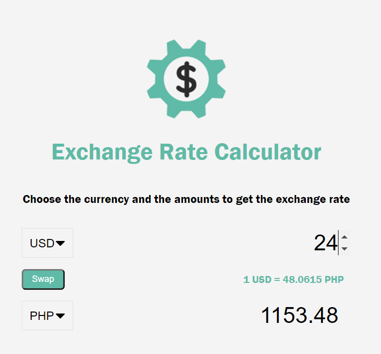

# World Currency Exchange Rate Calcuator
## Built on Vanilla Javascript and utilizes the Fetch API to gather exchange rates from Exchangerate-api.com 
## Allows clients to input desired country rate and outputs secondary country rate
## Allows for swapping of the two countries selected
## Allows for any amount to converted 

